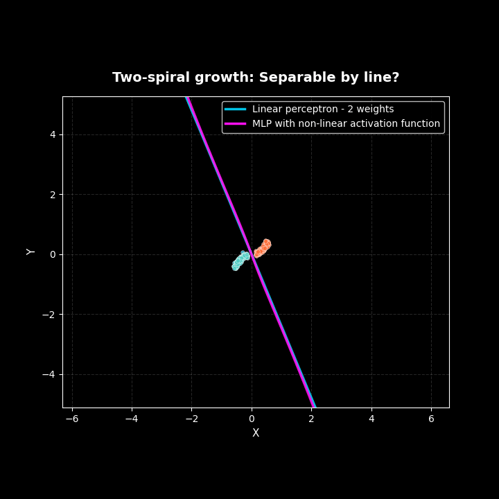

# Two-Spiral Classification: Understanding Non-Linear Activation Functions



## 🎯 Overview

This project provides a **visual demonstration** of why non-linear activation functions are essential in neural networks. Through an animated spiral growth experiment, you'll see exactly when and why a linear model fails and how a simple multi-layer perceptron (MLP) with non-linear activation succeeds.

## 🧠 The Theory

### Why Non-Linearity Matters

Understanding the necessity of non-linear functions in learning models is crucial. When examining a multi-layered perceptron, it's initially easy to understand why many parameters are needed to perform complex transformations. However, **the role of the activation function is more esoteric** and requires deeper exploration.

As my professor stated: *"The activation function is what gives the neural network its power."*

### Linear Separability

Some datasets can be separated by a straight line (or hyperplane in higher dimensions). In such cases, a simple perceptron with just two weights can effectively distinguish between classes in two-dimensional space.

**Linear Model:**
- Architecture: Input → Output (no hidden layer)
- Parameters: 2 weights, no bias
- Decision boundary: `w₁x + w₂y = 0` (a line through the origin)
- Power: Can only learn linear separations

### The Spiral Problem

Consider the two-spiral dataset:
- **Initially**: When the spirals are short, they're linearly separable. The learned blue line successfully divides them.
- **As spirals grow**: The datasets curve around each other, making linear separation impossible.
- **The breakthrough**: A non-linear activation function allows the model to curve around the spiral.

### The Non-Linear Solution

**Multi-Layer Perceptron (MLP):**
- Architecture: Input (2) → Hidden Layer (4) → Output (1)
- Parameters: 12 trainable weights, no bias
  - W1: (2×4) = 8 weights
  - W2: (4,) = 4 weights
- Activation: `tanh` (hyperbolic tangent)
- Decision boundary: A curved surface that wraps around the spirals

The purple line in the animation shows how just **4 hidden neurons with 12 parameters** can successfully separate the spirals by learning a non-linear decision boundary.

## 🔬 Mathematical Formulation

### Linear Model (Blue Line)
```
z = X @ w
prediction = sigmoid(z) ≥ 0.5
Decision boundary: w₁x + w₂y = 0
```

### Non-Linear MLP (Purple Line)
```
z₁ = X @ W1          # Linear transformation to hidden layer
a₁ = tanh(z₁)        # Non-linear activation (THE KEY!)
z₂ = a₁ @ W2         # Linear combination of activated features
prediction = sigmoid(z₂) ≥ 0.5
Decision boundary: Complex curved surface
```

**The magic happens at `tanh(z₁)`** - this non-linearity allows the network to:
1. Learn curved feature representations
2. Combine them to form complex decision boundaries
3. Separate non-linearly separable data

### Why "No Bias"?

Both models operate **without bias terms**, forcing all decision boundaries to pass through the origin. This constraint:
- Simplifies the visualization
- Demonstrates that non-linearity alone (not just more parameters) provides the power
- Shows that even minimal architectures can be powerful with activation functions

## 🎨 Visualization Features

### Dark Mode Theme
Professional dark background with vibrant colors for better visibility and modern aesthetics.

### Color Scheme
- **🔵 Cyan Line**: Linear only model boundary
- **🟣 Magenta Line**: MLP with non-linear activation model boundary

### Animation Flow
1. Spirals start short and linearly separable
2. Both models perform well initially
3. Spirals grow longer and begin to curve
4. Linear model fails (warning flashes!)
5. MLP continues to adapt with curved boundaries
6. Final frames show clear superiority of non-linear approach

## 🚀 Setup and Usage

### Prerequisites
```bash
pip install numpy matplotlib pillow
```

Or if using a virtual environment (recommended in WSL/Ubuntu):
```bash
python3 -m venv venv
source venv/bin/activate
pip install numpy matplotlib pillow
```

### Running the Experiment
```bash
python3 spiral_demo.py
```

This generates:
- `spiral_linear_vs_nonlinear_h4.gif` - The animated visualization
- `spiral_accuracy_summary_h4.png` - Accuracy comparison plot

## 🎛️ Configuration Knobs

You can customize the experiment by modifying parameters in the `if __name__ == "__main__"` block:

### Data Parameters
```python
n_per_class=250      # Number of points per spiral (default: 250)
noise=0.035          # Gaussian noise added to points (default: 0.035)
theta_start=0.7      # Initial spiral length in radians (default: 0.7)
theta_end=6.2        # Final spiral length in radians (default: 6.2)
n_steps=18           # Number of animation frames (default: 18)
seed=3               # Random seed for reproducibility (default: 3)
```

### Model Parameters
```python
mlp_hidden=4         # Number of hidden neurons (default: 4)
                     # Total params = 3*mlp_hidden = 12 for h=4
mlp_activation="tanh"  # Activation function: "tanh" or "relu"
```

### Training Parameters (in function definitions)
```python
# Linear model
lr=0.8               # Learning rate
steps=2500           # Training iterations
l2=2e-4              # L2 regularization

# MLP model
lr=0.4               # Learning rate
steps=5000           # Training iterations
l2=2e-4              # L2 regularization
```

### Example: Smaller Network
```python
mlp_hidden=2         # Only 2 hidden neurons
                     # Total params = 3*2 = 6
```

### Example: Different Activation
```python
mlp_activation="relu"  # Use ReLU instead of tanh
```

### Example: Longer Spirals
```python
theta_end=9.0        # Much longer spirals
n_steps=25           # More animation frames
```

## 📊 Output Files

The filenames automatically include the hidden layer size:
- `spiral_linear_vs_nonlinear_h{N}.gif` - Animation
- `spiral_accuracy_summary_h{N}.png` - Accuracy plot

Where `{N}` is the value of `mlp_hidden`.

## 🤝 Contributing

Feel free to fork this repository and experiment! Suggestions for improvements:
- 3D spiral visualization
- Additional activation functions (sigmoid, leaky ReLU, GELU)
- Comparison with other architectures
- Interactive parameter tuning

## 📝 License

This project is open source and available for educational purposes.

---

**Remember**: *The activation function is what gives the neural network its power.* 🧠✨
